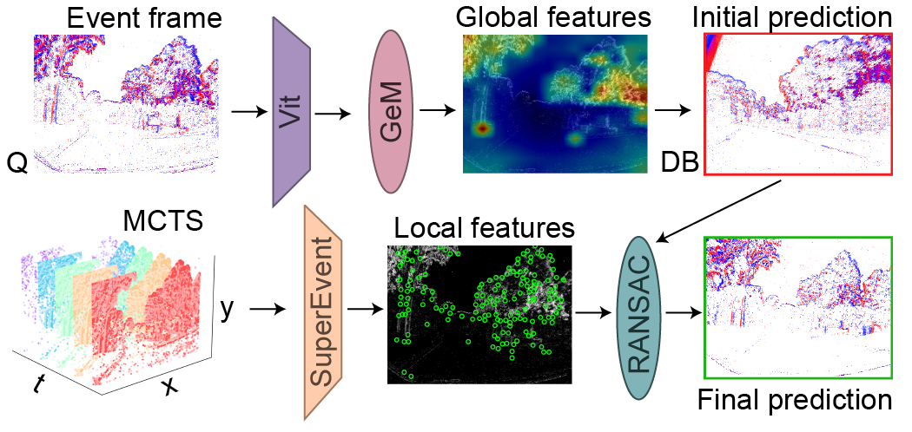

# :gem: Event-GeM: Global-to-Local Feature Fusion for Event-Based Visual Place Recognition
[](https://creativecommons.org/licenses/by-nc-sa/4.0/)
[](https://pixi.sh)
[](https://github.com/AdamDHines/Event-GeM/stargazers)
[](./README.md)

This repository contains the code for Event-GeM — an event-based visual place recognition (VPR) pipeline that uses a pre-trained transformer vision backbone for feature extraction, generalized mean pooling, and keypoint detection for 2D homology match re-ranking.

<p style="width: 100%; display: block; margin-left: auto; margin-right: auto">
  
</p>

Event-GeM uses features from the [Event-Camera-Data-Pre-Training](https://github.com/Yan98/Event-Camera-Data-Pre-training) and a generalized mean (GeM) pooling layer to generate initial matches from event frames. [SuperEvent](https://github.com/ethz-mrl/SuperEvent) then allows for 2D homology re-ranking of the TopK matches based on keypoint selection for improved recall performance. Datasets for VPR are managed and generated using [Event-LAB](https://github.com/EventLAB-Team/Event-LAB).

## Getting Started :rocket:
Event-GeM is powered by [Pixi](https://pixi.sh/latest/) for all dependency and package management. If not already installed, run the following in your command terminal:

```console
curl -fsSL https://pixi.sh/install.sh | sh
```

_For more information, please see the [pixi documentation](https://pixi.sh/latest/)._

Next, clone our repository **with all the required submodules** and navigate to the project directory by running the following in your command terminal:

```console
git clone git@github.com:AdamDHines/Event-GeM.git eventgem --recurse-sumodules && cd eventgem
```

Once installed, you can quickly try Event-GeM with our demo by running the following in your command terminal:

```console
pixi run demo
```

_Please note: this will require **~35.9GB** of storage space to download and generate event data, ensure you have enough space on your local disk before proceeding. First runs will take a while to complete, as generating event images can be time intensive - this is normal._

## Feature Extraction

## Re-ranking and Recall@K Analysis

## Citation

## Contributing and Issues