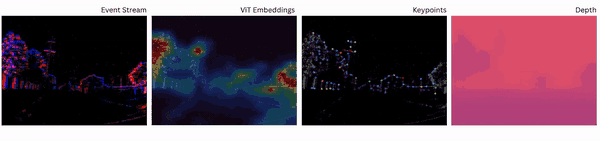

# :gem: EventGeM: Global-to-Local Feature Matching for Event-Based Visual Place Recognition
[](https://creativecommons.org/licenses/by-nc-sa/4.0/)
[](https://pixi.sh)
[](https://github.com/AdamDHines/Event-GeM/stargazers)
[](./README.md)

This repository contains the code for Event-GeM — an event-based visual place recognition (VPR) pipeline that uses a pre-trained transformer vision backbone for feature extraction, generalized mean pooling, and keypoint detection for 2D homology match re-ranking.

<p style="width: 200%; display: block; margin-left: auto; margin-right: auto">
  
</p>

Event-GeM uses features from the [Event-Camera-Data-Pre-Training](https://github.com/Yan98/Event-Camera-Data-Pre-training) and a generalized mean (GeM) pooling layer to generate initial matches from event frames. [SuperEvent](https://github.com/ethz-mrl/SuperEvent) then allows for 2D homology re-ranking of the TopK matches based on keypoint selection for improved recall performance. Optional additional re-ranking can be performed with [Depth AnyEvent](https://github.com/bartn8/depthanyevent) using a structural similarity index. Datasets for VPR are managed and generated using [Event-LAB](https://github.com/EventLAB-Team/Event-LAB).

## Getting Started :rocket:
Event-GeM is powered by [Pixi](https://pixi.sh/latest/) for all dependency and package management. If not already installed, run the following in your command terminal:

```console
curl -fsSL https://pixi.sh/install.sh | sh
```

_For more information, please see the [pixi documentation](https://pixi.sh/latest/)._

Next, clone our repository **with all the required submodules** and navigate to the project directory by running the following in your command terminal:

```console
git clone git@github.com:AdamDHines/Event-GeM.git eventgem --recurse-submodules && cd eventgem
```

Once installed, you can quickly try Event-GeM with our demo by running the following in your command terminal:

```console
pixi run demo
```

## Running EventGeM & EventGeM-D :sparkles:
### Basic operation
To run EventGeM and EventGeM-D, you simply need to input a dataset, reference, and query that you would like to run in a single command-line invocation:

```console
pixi run eventgem --dataset brisbane_event --reference sunset2 --query sunset1
```

This will generate all of the event-based frame types needed for the various backbones. If you wish to save on disk space, you can instead stream from the event file:

```console
pixi run eventgem --dataset brisbane_event --reference sunset2 --query sunset1 --stream
```

[Event-LAB](https://github.com/EventLAB-Team/Event-LAB) handles the generation of a pseudo-ground truth file for Recall@K evaluation, which runs automatically.

By default, the EventGeM method will run, however if you want to run the EventGeM-D depth based re-rank run:

```console
pixi run eventgem --dataset brisbane_event --reference sunset2 --query sunset1 --method eventgem-d
```

### List of arguments
#### Dataset parameters
- `--dt-ms`: max time in msec to consturct polarity and tencode frames to (default=50)
- `--mcts-time`: list of times to construct the MCTS frames with (deafult=[10, 20, 30, 40, 50])
- `--time-scale`: time scale of the event timestamps (default=1e-9)
- `--start-time`: delay time for streaming from event files for synchronizing (default=None)
- `--skip`: number of frames to skip during inference (default=None)

#### Model parameters
- `--stream`: stream from event file instead of generating and saving event frames
- `--top-k`: top-k reference to run the re-ranking on (default=50)
- `--se-topk`: number of keypoints to detect per frame and run RANSAC on (default=170)
- `--backbone-batch-size`: batch size for running the initial ViT embeddings (non-stream mode only)
- `--keypoint-batch-size`: batch size for running the keypoint detection (non-stream mode only)
- `--rerank-mode`: run keypoint, depth, or both re-rank options (default="keypoints")
- `--method`: VPR method to run during inference (default="eventgem")

#### Directory parameters
- `--data-root`: default root directory to store datasets (default="./eventgem/data")
- `--feature-out`: default directory for ViT embedding features (default="./eventgem/features")
- `--keypoint-out`: default directory for keypoints (default="./eventgem/keypoints")
- `--depth-out`: default directory for depth maps (default="./eventgem/depth")

## Citation :scroll:
If you found our work interesting or use it as a baseline method, please cite the following:

```
@misc{hines2026eventgem,
      title={EventGeM: Global-to-Local Feature Matching for Event-Based Visual Place Recognition}, 
      author={Adam D. Hines and Gokul B. Nair and Nicolás Marticorena and Michael Milford and Tobias Fischer},
      year={2026},
      eprint={2603.05807},
      archivePrefix={arXiv},
      primaryClass={cs.CV},
      url={https://arxiv.org/abs/2603.05807}, 
}
```

## Contributing and Issues :question:
If you encounter any issues or want to contribute a fix, please [open an issue](https://github.com/AdamDHines/Event-GeM/issues) or a [pull request](https://github.com/AdamDHines/Event-GeM/pulls).