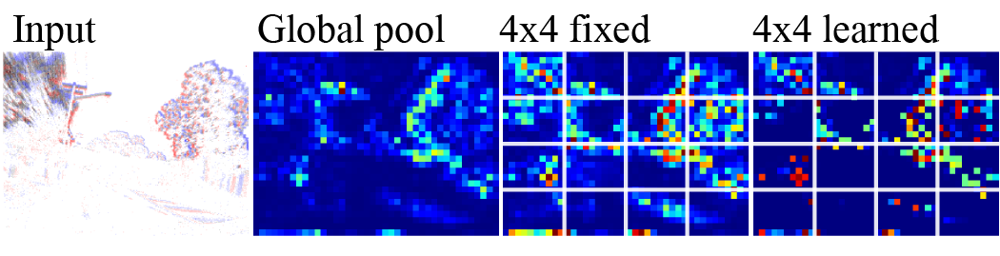

# :gem: EventGeM: Global-to-Local Feature Matching for Event-Based Visual Place Recognition
[](./LICENSE)
[](https://pixi.sh)
[](https://github.com/AdamDHines/Event-GeM/stargazers)
[](./README.md)

This repository contains the code for Event-GeM — an event-based visual place recognition (VPR) pipeline that runs global retrieval and local re-ranking off a **single** pre-trained backbone. One forward pass over an event frame produces both the global descriptor that builds the shortlist and the local keypoints that re-rank it.

<p align="center">
  
</p>

Event frames are constructed as multi-channel time surfaces (MCTS) and passed through [SuperEvent](https://github.com/ethz-mrl/SuperEvent). Its pre-head FPN feature map is generalized-mean (GeM) pooled over a 4×4 grid into a 2048-D global descriptor — one learned exponent per grid row, rising from sky to road — projected through a pre-trained head and matched by cosine similarity to produce a top-K shortlist. The keypoints and descriptors from the same forward pass then re-rank that shortlist: correspondences are filtered by mutual nearest neighbours and scored by RANSAC homography inliers. Datasets and pseudo-ground-truth files for VPR are managed and generated using [Event-LAB](https://github.com/EventLAB-Team/Event-LAB).

## Getting Started :rocket:
Event-GeM is powered by [Pixi](https://pixi.sh/latest/) for all dependency and package management. If not already installed, run the following in your command terminal:

```console
curl -fsSL https://pixi.sh/install.sh | sh
```

_For more information, please see the [pixi documentation](https://pixi.sh/latest/)._

Next, clone our repository **with all the required submodules** and navigate to the project directory by running the following in your command terminal:

```console
git clone git@github.com:AdamDHines/Event-GeM.git eventgem --recurse-submodules && cd eventgem
```

`--recurse-submodules` is not optional — Event-GeM refuses to start if the `superevent` or `eventlab` submodules are missing. There is no separate model download step: the SuperEvent weights (`super_event_weights.pth`) are committed inside the SuperEvent submodule and arrive with the clone.

> **Platforms:** the pixi environment targets `linux-64` and `linux-aarch64` with CUDA 12. There is no macOS or Windows environment.

### Pre-trained model
The EventGeM projection head is downloaded automatically on the first run, from [`AdamHines/eventgem`](https://huggingface.co/AdamHines/eventgem), and cached by `huggingface_hub` — so subsequent runs work offline, and `HF_HUB_OFFLINE=1` is respected. The SuperEvent trunk it sits on top of still comes from the submodule.

If you have features cached from a previous version of Event-GeM, pass `--rerun-features` once: the descriptor changed, but the cached similarity matrix is not named for it.

## Running EventGeM :sparkles:
### Basic operation
To run EventGeM you need a dataset, a reference traverse, and a query traverse in a single command-line invocation:

```console
pixi run eventgem --dataset brisbane_event --reference sunset2 --query sunset1
```

This extracts global descriptors and keypoints for both traverses, re-ranks the top-K shortlist, and prints a Recall@1/5/10 table. Feature extraction is cached — a second run reuses what is on disk unless you pass `--rerun-features`.

### Expected data layout
Event data and the pseudo-ground-truth file are generated with [Event-LAB](https://github.com/EventLAB-Team/Event-LAB) and must exist before you run. Event-GeM expects them under `--data-root` (default `./eventgem/data`):

```
<data-root>/
└── brisbane_event/
    ├── sunset2/sunset2.hdf5
    ├── sunset1/sunset1.hdf5
    └── ground_truth/sunset2_sunset1_GT.npy
```

### Outputs
- Global descriptors are written under `--feature-out` (default `./eventgem/features`).
- Keypoints are written to a packed, memory-mapped store under `--keypoint-out` (default `./eventgem/keypoints`).
- Both similarity matrices are saved to `<data-root>/<dataset>/<reference>-<query>-similarity/` as `original_sim_mat.npy` and `reranked_sim_mat.npy`.
- Recall@1/5/10 for the shortlist and the re-ranked result is printed to the terminal.


```console
pixi run sunset2-sunset1 --data-root /path/to/datasets --feature-out /path/to/features --keypoint-out /path/to/keypoints
```

## List of arguments
### Dataset parameters
- `--dataset`, `-d`: dataset to evaluate; one of `brisbane_event`, `nsavp`, `fast_slow`, `qut_event_walking`
- `--reference`, `-r`: reference traverse name
- `--query`, `-q`: query traverse name
- `--dt-ms`: reconstruction time window in msec per frame (default=50)
- `--max-window-ms`: MCTS integration window in msec (default=`--dt-ms`, so each frame integrates its full window; pass 30 to reproduce legacy numbers)
- `--data-root`: root directory for datasets (default="./eventgem/data")
- `--ref-offset`: offset for the reference event stream start, in the dataset's native timestamp units (default=0)
- `--query-offset`: offset for the query event stream start (default=0)

### Model parameters
- `--top-k`: number of shortlist candidates to re-rank with 2D-homography (default=50)
- `--match-filter`: correspondence filter before RANSAC, `mutual` or `ratio` (default="mutual")
- `--match-ratio`: Lowe's ratio threshold, only used by `--match-filter ratio` (default=0.8)
- `--ransac-thresh`: RANSAC pixel threshold (default=5.0)
- `--inlier-weight`: distance subtraction per RANSAC inlier (default=0.05)
- `--keypoint-batch-size`: batch size for the backbone forward pass (default=16)
- `--se-config`: path to the SuperEvent config file (default="eventgem/external/superevent/config/super_event.yaml")
- `--se-weights`: path to the SuperEvent weights file (default="eventgem/external/superevent/saved_models/super_event_weights.pth")
- `--feature-out`: directory for global descriptors (default="./eventgem/features")
- `--keypoint-out`: directory for the keypoint store (default="./eventgem/keypoints")

### Re-run options
- `--rerun-features`: re-run feature extraction even if cached features already exist

## Citation :scroll:
If you found our work interesting or use it as a baseline method, please cite the following:

```
@misc{hines2026eventgem,
      title={EventGeM: Global-to-Local Feature Matching for Event-Based Visual Place Recognition}, 
      author={Adam D. Hines and Gokul B. Nair and Nicolás Marticorena and Michael Milford and Tobias Fischer},
      year={2026},
      eprint={2603.05807},
      archivePrefix={arXiv},
      primaryClass={cs.CV},
      url={https://arxiv.org/abs/2603.05807}, 
}
```

## Contributing and Issues :question:
If you encounter any issues or want to contribute a fix, please [open an issue](https://github.com/AdamDHines/Event-GeM/issues) or a [pull request](https://github.com/AdamDHines/Event-GeM/pulls).
